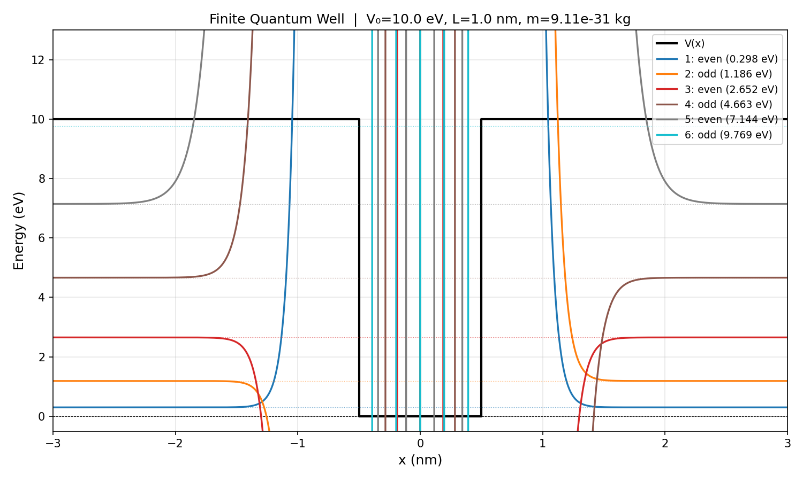

# Finite Quantum Well Solver

A Python program that computes and visualizes the **bound-state wavefunctions and energy levels** of a finite square quantum well.

> **Course Assignment** — Computational Physics

---

## Physics Background

A finite quantum well is a 1D potential defined as:

$$V(x) = \begin{cases} 0 & |x| \leq L/2 \\ V_0 & |x| > L/2 \end{cases}$$

Bound states exist for $0 < E < V_0$. Inside the well the solutions are sinusoidal; outside they decay exponentially. Matching boundary conditions leads to two transcendental equations:

| Parity | Equation |
|--------|----------|
| Even   | $k \tan(ka) = \kappa$ |
| Odd    | $-k \cot(ka) = \kappa$ |

where $k = \sqrt{2mE}/\hbar$ (inside) and $\kappa = \sqrt{2m(V_0-E)}/\hbar$ (outside), and $a = L/2$.

Wavefunctions are **normalized** such that $\int_{-\infty}^{\infty} |\psi(x)|^2\, dx = 1$.

---

## Files

| File | Description |
|------|-------------|
| `quantum_well.py` | Interactive single-case solver (prompts for input) |
| `quantum_well_demo.py` | Automated 4-case comparison plot (no input needed) |

---

## Requirements

```
Python >= 3.8
numpy
scipy
matplotlib
```

Install dependencies:

```bash
pip install numpy scipy matplotlib
```

---

## Usage

### Single case (interactive)

```bash
python quantum_well.py
```

You will be prompted for:
- Particle mass `m` (kg), e.g. `9.11e-31` for an electron
- Barrier height `V0` (eV), e.g. `10`
- Well width `L` (nm), e.g. `1`

**Example output:**
```
束縛態 / Bound states (V0 = 10.0 eV, L = 1.0 nm):
  1: even,  E = 0.297584 eV
  2: odd ,  E = 1.186194 eV
  3: even,  E = 2.651710 eV
  4: odd ,  E = 4.662779 eV
  5: even,  E = 7.144173 eV
  6: odd ,  E = 9.768942 eV
```

### Four-case demo (no input required)

```bash
python quantum_well_demo.py
```

Automatically runs and plots these four cases side by side:

| Case | Parameters | Key observation |
|------|-----------|-----------------|
| Shallow well | $V_0=1\,\text{eV},\ L=1\,\text{nm}$ | Only 1–2 bound states; heavy evanescent leakage |
| Wide well | $V_0=10\,\text{eV},\ L=5\,\text{nm}$ | Many closely spaced levels |
| Heavy particle (proton) | $m=1.67\times10^{-27}\,\text{kg}$ | Dozens of states due to large mass |
| Narrow well | $V_0=10\,\text{eV},\ L=0.2\,\text{nm}$ | Approaches infinite square well ($E_n \propto n^2/L^2$) |

---

## Method

1. **Root finding** — scan $E \in (0, V_0)$ with 80,000 points and use `scipy.optimize.brentq` to bracket and refine roots of the transcendental equations. Poles of $\tan/\cot$ are filtered by checking for large discontinuities.
2. **Wavefunction construction** — piecewise analytical form: cosine/sine inside, decaying exponential outside.
3. **Normalization** — numerical integration via `scipy.integrate.quad` to enforce $\int|\psi|^2dx=1$.
4. **Visualization** — each wavefunction is offset by its energy level for a physically intuitive display.

---

## Sample Plot



*Wavefunctions plotted at their respective energy levels inside the potential well outline.*

---

## Physical Constants Used

| Constant | Value |
|----------|-------|
| $\hbar$ | $1.054571817 \times 10^{-34}\ \text{J·s}$ |
| $1\ \text{eV}$ | $1.602176634 \times 10^{-19}\ \text{J}$ |
| Electron mass $m_e$ | $9.10938 \times 10^{-31}\ \text{kg}$ |
| Proton mass $m_p$ | $1.67262 \times 10^{-27}\ \text{kg}$ |
